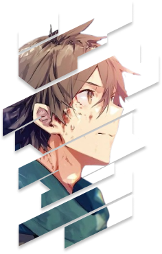

<!-- =========================
     HERO / HEADER
========================= -->

<p align="center">
  
</p>

<p align="center">
  
</p>
<p align="center">
  <sub>
    <strong>matrix-1407</strong> • Web Developer • Cloud & DevOps
  </sub>
</p>
<h2 align="center">
  <code>console.log("welcome to my side of the matrix");</code>
</h2>

<p align="center">
  <em>
    Building interfaces ✨ & backends ⚙️ — learning cloud the hard way ☁️  
    <br/>
    DevOps-curious · “it works on my machine” survivor
  </em>
</p>

<br/>

<hr style="width:60%; margin:auto;" />


<!-- =========================
     ABOUT
========================= -->

</br>

## 👾 About

</br>




- 🎓 **E&TC Engineering student** 
- 🧑‍💻 Bio: `Engineering student with
  hands-on experience in building end-to-end
  IoT solutions. Passionate about solving
  tangible problems. Actively developing skills in fullstack development and cloud
  technologies`  
- 🔌 Interested in **JavaScript → Node.js/Express**, **Cloud & DevOps**, and building things that touch the real world   
- 🌌 I like solitude, closing my eyes and just listening to music to escape reality🎶🎧 
- 🏎️ F1, ⚽ football, ♟️ chess, and 🎌 anime keep my brain entertained 🎞️


```text
[ booting profile... ]
> establishing secure connection to the Matrix
> status: ONLINE ▓▓▓▓▓▓▓▓▓▓ 100%
```


## 🎯 Current Focus
- Daily practice: **JavaScript & Node.js/Express.js** (small tools + services)  
- Databases & APIs: **PostgreSQL**, Schema design, **REST APIs**  
- Cloud basics: **Linux**, **AWS fundamentals**, and simple CI/CD pipelines  
- Building a clean portfolio of end-to-end projects (web + IoT)
---

## 🛠 Tech Stack & Tools

<p align="center">

<!-- Core stack: use shields as fallback for icons you may not have locally -->


<br/>


<!-- Core Stack -->


<br/>

<!-- Languages -->


<br/>

<!-- Databases & APIs -->


<br/>

<!-- Cloud & DevOps -->


<br/>

<!-- Tools (fallback to shields) -->


---
## 📬 Contact

<!-- Right-side GIF -->

<br/>
<p align="center">
  <a href="https://www.instagram.com/mrudul._.exe/" target="_blank">
    
  </a>
  <br/>
  <br/>
  <br/>

  <a href="https://www.linkedin.com/in/mrudul-bokade-140705mb/" target="_blank">
    
  </a>
  <br/>
  <br/>
  <br/>

  <a href="mailto:mrudulbokade1407@gmail.com">
    
  </a>
  <br/>
  <br/>
</p>

<br clear="left"/>


## 📊 GitHub Stats

<p align="center">
  
</p>

<p align="center">
  
</p>


> "There is no shortcut. Only systems, discipline, and patience."

